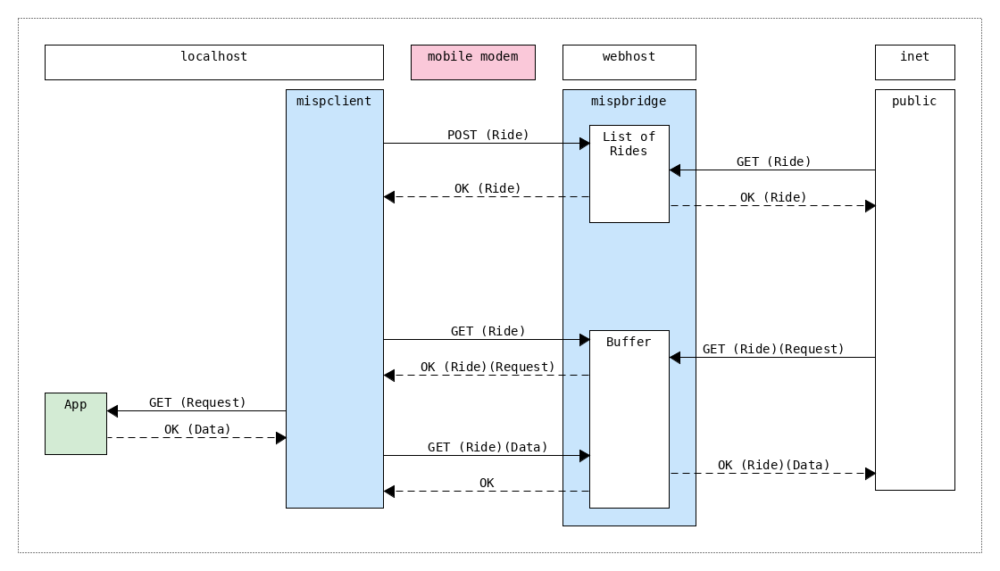

### About
The goal of this project is to bypass the limitations caused by ISPs blocking incoming connections.
It is estimated to require two servlets - one on the webhost (`misp-bridge`), and one on the localhost (`misp-client`).

### Overview

### How to Run
* Install Tomcat
    * `apt-get install tomcat9`
* Start Tomcat:
    * `/usr/bin/tomcat9-instance-create -p 9090 <foo>/tomcat/`
    * `<foo>/tomcat/bin/startup.sh`
* Link this project to where Tomcat expects files:
    * `ln -s <bar>/mispbridge/ <foo>/tomcat/webapps/`
    * `ln -s <bar>/mispclient/ <foo>/tomcat/webapps/`
