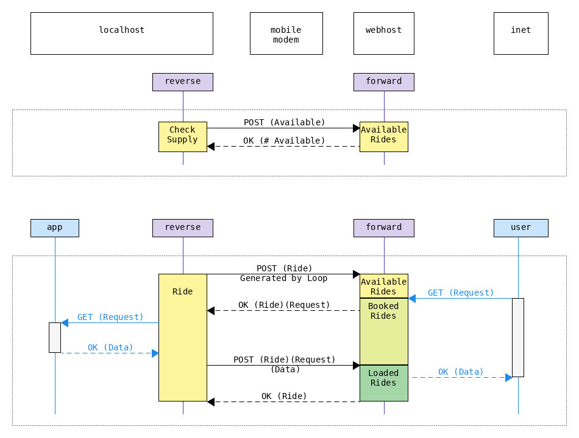

### About
The goal of this project is to bypass the limitations caused by ISPs blocking incoming connections.
To do so, the proxy `reverse` is created. 
`reverse` sends `Ride` objects to another proxy, which is called `forward`.
`forward` waits for a request from the `user`, 
and inserts the request into the `Ride` object received form `reverse`.
The `Ride` object is then sent back to `reverse`.
`reverse` subsequently forwards the request contained in the `Ride` object to the `app`.
Upon recieving a reply with data from `app`, `reverse` will forward this data to `forward`,
which in turn will finally forward it to the `user`.

#### Control
##### Routing / Access Control
* currently, there is a 1:1 mapping between `forward` and `reverse`.
  * thus any `Ride` "submitted" to `forward` will 
    naturally be selected, and circle back to `reverse`. 
* thus `forward` and `Ride` can both be stateless.
* if any access control, name resolution, port forwarding were to happen, 
  it would be done in `reverse`. 

 

### Overview

#### What works:
* Forwarding GET requests (including HTTPS).
#### What does not work:
* Handling 301 (Moved Permanently).
* Forwarding PUT requests - if needed, the logic might be quickly added to `doPut` in `forward`.
* The `forward.war` has issues - meanwhile run `forward` embedded with Jetty.

 

### Demo

 

### Run / Deploy

#### How to Run / Debug
* `com.olexyn.misp.embedded.RunAll.main()`

 

#### How to Deploy
* Set the URIs in code.
* Build (e.g. with `build-install-all.sh`)
* Put the generated `forward-0.1.war` in a servlet container (e.g. Jetty).
* Launch the `reverse-0.1.jar` on your host. 

### Migration (WIP)

#### How would we even test this?
* one instance of `foward`
* one instance of `reverse`
* one instance of `mirror`
* `reverse` uses `mirror` as app
* we call `forward` and see `mirror`

#### Steps TODO
* migrate `forward` to Spring ✅ 
* parametrize URLs
* check if `mirror` works
* 
